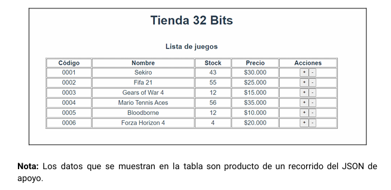

# Desafío - Vuex

## Introducción

Validaremos nuestros conocimientos para implementar un aplicativo web utilizando Vuex para el almacenamiento del estado de los componentes y dar solución a un problema. 

## Descripción

La tienda de juegos de video **32bits** te ha encargado desarrollar un prototipo para su nuevo sistema de productos. Para esto, se le ha solicitado el desarrollo de una aplicación SPA utilizando VueJS mediante la creación del proyecto con Vite, además la incorporación de Vuex para controlar todos los datos de forma centralizada.

El listado de juegos está en formato JSON.

A continuación, te mostramos una imagen del resultado final de ejecución.

## Requerimientos

1. Crear un proyecto con Vite
2. Alojar el JSON de juegos en el estado global de la aplicación.
3. Utilizar *mapState* para el consumo de los juegos en el componente App.
4. Utilizar *acciones* para modificar el stock de los videojuegos.

## Tecnologías utilizadas

